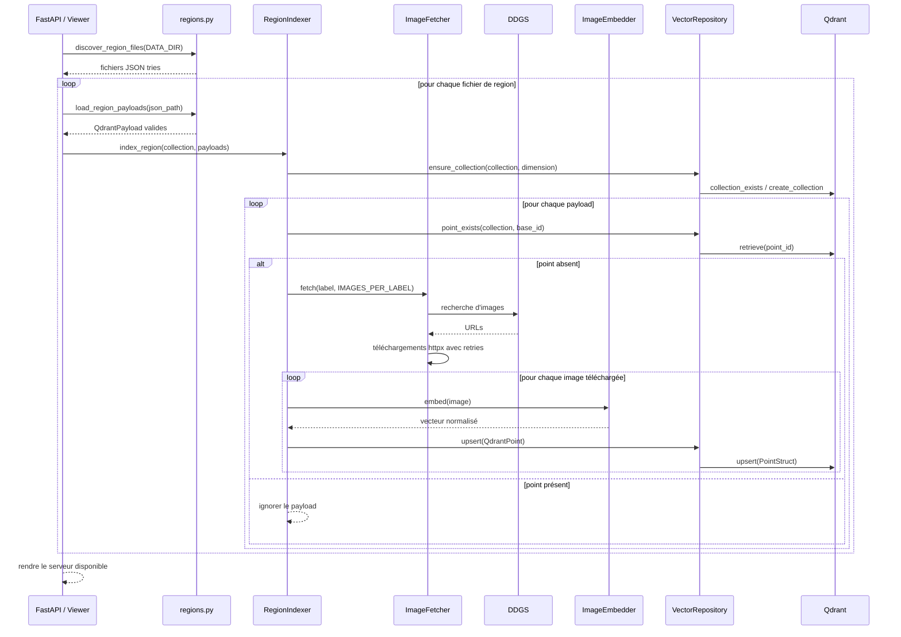
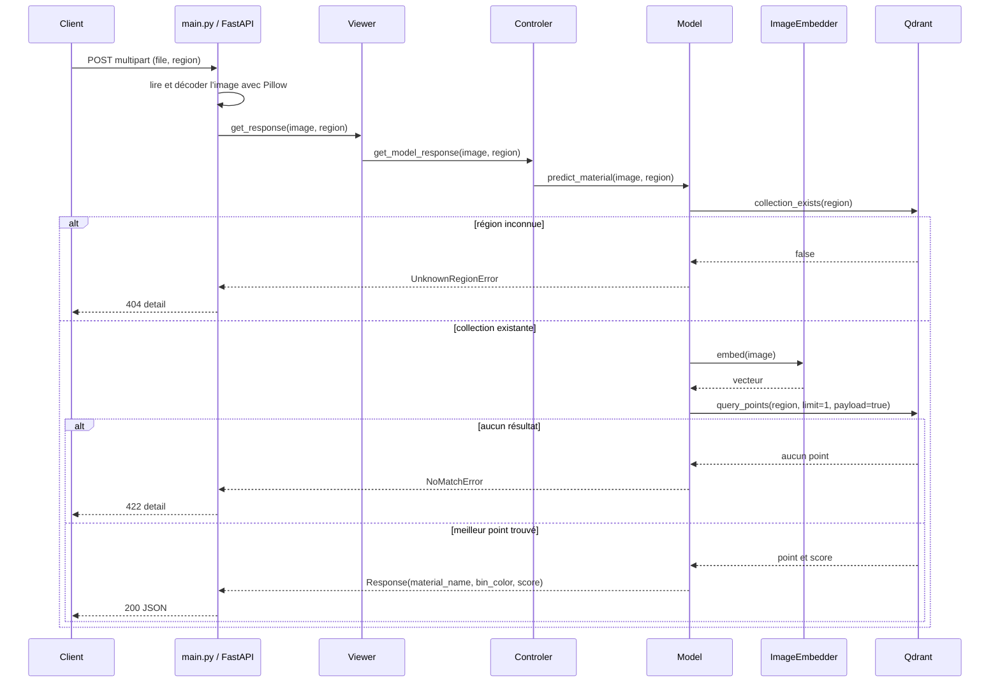
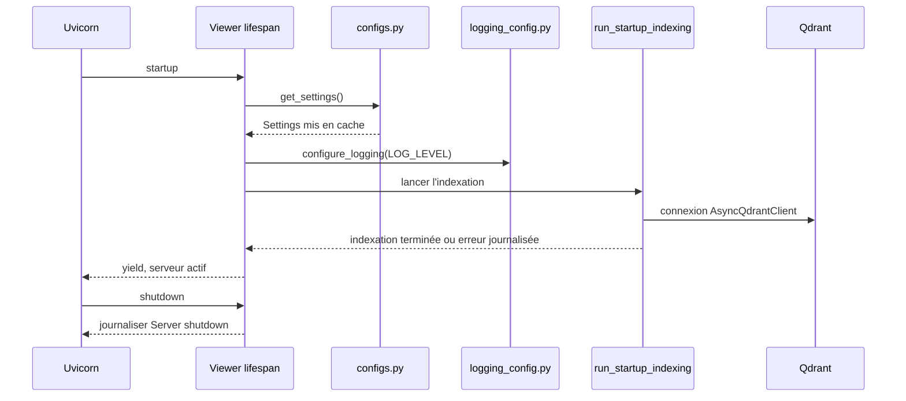

# Greener — classification des déchets par région

Greener est une API FastAPI de classification d'images de déchets. Au démarrage, l'application découvre des fichiers JSON de régions, recherche des images de référence, les transforme en vecteurs avec DINOv2 et les stocke dans des collections Qdrant séparées par région. Une image envoyée à l'API est ensuite comparée au contenu de la collection de la région demandée afin de retourner le matériau reconnu, la couleur de poubelle associée et le score de similarité.

## Architecture

```text
.
├── main.py                 # Entrée de l'application et endpoint HTTP
├── configs.py              # Paramètres typés chargés depuis l'environnement et .env
├── logging_config.py       # Configuration centralisée des logs
├── viewer.py               # Application FastAPI, cycle de vie et indexation au démarrage
├── controler.py            # Couche de coordination entre la vue et le modèle
├── model.py                # Embedding de la requête et recherche de similarité Qdrant
├── indexer.py              # Orchestration de l'indexation multi-région
├── fetcher.py              # Recherche et téléchargement des images de référence
├── embedder.py             # Encodage d'images avec DINOv2 et PyTorch
├── repository.py           # Accès asynchrone aux collections et points Qdrant
├── regions.py              # Découverte et validation des fichiers JSON de régions
├── schemas.py              # Modèles Pydantic des données et points vectoriels
├── docker-compose.yaml     # Services web et qdrant
├── dockerfile              # Image Python de l'API
└── qdrant.dockerfile       # Image Qdrant personnalisée et healthcheck
```

Rôles détaillés :

- `main.py` instancie `Viewer` sous le nom `servapp`, définit l'endpoint multipart et lance Uvicorn quand le fichier est exécuté directement.
- `viewer.py` configure le lifespan FastAPI, déclenche l'indexation de toutes les régions avant de rendre l'application disponible et délègue les requêtes à `Controler`.
- `controler.py` fait le lien entre la vue et `Model`.
- `model.py` vérifie la collection de la région, calcule l'embedding de l'image et interroge Qdrant avec une limite de 1 résultat.
- `indexer.py` crée les collections, vérifie les identifiants déjà présents et orchestre la récupération, l'embedding et l'upsert des images par région.
- `fetcher.py` utilise `DDGS` pour rechercher des URLs d'images, `httpx` pour les télécharger avec retries et limite de concurrence, et peut enregistrer une copie JPEG locale.
- `embedder.py` charge le processeur et le modèle Hugging Face configuré, puis produit un vecteur normalisé à partir du premier token de `last_hidden_state`.
- `repository.py` utilise `AsyncQdrantClient`, crée des collections en distance cosinus et écrit des `PointStruct` contenant le vecteur et le payload.
- `regions.py` lit les fichiers `*.json`, impose une racine de type liste et ignore les entrées invalides après validation Pydantic.
- `schemas.py` définit `WasteItem`, `QdrantPayload` (`nom`, `region`, `poubelle`) et `QdrantPoint`.

## Prérequis

- Python 3.13, conformément aux images utilisées par `dockerfile`.
- Les dépendances Python importées par le code : FastAPI, Uvicorn, Pydantic, `pydantic-settings`, `httpx`, Pillow, NumPy, PyTorch, Transformers, `qdrant-client` et `ddgs`.
- Un serveur Qdrant accessible avec le host et le port configurés.
- Un répertoire de données contenant un ou plusieurs fichiers JSON de région. Chaque fichier doit contenir une liste d'objets ayant au minimum les clés `nom` et `poubelle`; le nom du fichier sans extension devient le nom de la région et de la collection Qdrant.
- Accès réseau à la recherche d'images et au téléchargement des images de référence lors de l'indexation.
- Pour le mode Docker, Docker avec Docker Compose et les fichiers de construction attendus par `dockerfile` (`pyproject.toml`, `uv.lock` et un répertoire `src`).

## Configuration

La configuration applicative est chargée par `Settings` depuis `.env` et l'environnement, avec des valeurs par défaut dans `configs.py`. Les valeurs ne sont pas reproduites ici.

| Variable | Rôle |
|---|---|
| `EMBEDDING_MODEL_NAME` | Identifiant du modèle d'embedding Hugging Face |
| `AI_HOST` | Adresse d'écoute de l'API |
| `AI_PORT` | Port d'écoute de l'API |
| `QDRANT_HOST` | Hôte Qdrant |
| `QDRANT_PORT` | Port HTTP Qdrant utilisé par le client |
| `DATA_DIR` | Répertoire des JSON de régions |
| `IMAGES_PER_LABEL` | Nombre d'images recherchées par libellé |
| `REQUEST_TIMEOUT` | Timeout des téléchargements, en secondes |
| `MAX_RETRIES` | Nombre maximal d'essais par téléchargement |
| `MAX_CONCURRENT_DOWNLOADS` | Nombre maximal de téléchargements simultanés |
| `DEVICE` | Périphérique PyTorch |
| `SAVE_IMAGES` | Active la sauvegarde locale des images |
| `IMAGE_BACKUP_DIR` | Répertoire des sauvegardes d'images |
| `LOG_LEVEL` | Niveau des logs applicatifs |
| `QDRANT_VERSION` | Version utilisée comme argument de build de l'image Qdrant |
| `QDRANT_GRPC_PORT` | Port gRPC Qdrant exposé par Compose |
| `QDRANT_LOG_LEVEL` | Niveau de logs Qdrant injecté dans le service Qdrant |

Pour un fichier `.env`, utiliser des placeholders sans y inscrire de secrets dans la documentation :

```dotenv
EMBEDDING_MODEL_NAME=<nom-modele>
AI_HOST=<adresse-ecoute>
AI_PORT=<port-api>
QDRANT_HOST=<hote-qdrant>
QDRANT_PORT=<port-http-qdrant>
DATA_DIR=<repertoire-donnees>
IMAGES_PER_LABEL=<nombre-images>
REQUEST_TIMEOUT=<timeout-secondes>
MAX_RETRIES=<nombre-retries>
MAX_CONCURRENT_DOWNLOADS=<concurrence>
DEVICE=<cpu-ou-device-torch>
SAVE_IMAGES=<true-ou-false>
IMAGE_BACKUP_DIR=<repertoire-backup>
LOG_LEVEL=<niveau-log>
QDRANT_VERSION=<version-qdrant>
QDRANT_GRPC_PORT=<port-grpc-qdrant>
QDRANT_LOG_LEVEL=<niveau-log-qdrant>
```

## Lancement local

1. Préparer l'arborescence attendue par les imports du projet (`src/` est utilisé par plusieurs imports relatifs et par `main.py`).
2. Créer et activer un environnement virtuel :

```bash
python3.13 -m venv .venv
source .venv/bin/activate
```

3. Installer les dépendances du projet avec le gestionnaire  `uv` :

```bash
uv sync
```
4. Placer les fichiers JSON de régions dans `DATA_DIR`, démarrer Qdrant sur `QDRANT_HOST:QDRANT_PORT`, puis lancer l'application avec la commande réellement présente dans ` main.py` :

```bash
uv run python main.py
```

Cette commande appelle `uvicorn.run(app=servapp, host=settings.ai_host, port=settings.ai_port)`. L'indexation de démarrage est exécutée avant que le lifespan ne rende le contrôle à l'application.

## Lancement avec Docker Compose

Depuis le répertoire contenant `docker-compose.yaml`, `.env`, `dockerfile`, `qdrant.dockerfile`, les sources et les fichiers de packaging :

```bash
docker compose up --build
```

Les services définis sont :

- `web` : construit l'image depuis `dockerfile`, expose `${AI_PORT}` sur le même port, monte `./data` vers `/greener/data`, `./images` vers `/greener/images` et `./backup_images` vers `/greener/backup_images`. Il attend le healthcheck de `qdrant`.
- `qdrant` : construit depuis `qdrant.dockerfile`, persiste ses données dans le volume `qdrant_storage`, expose le port HTTP `${QDRANT_PORT}` et le port gRPC `${QDRANT_GRPC_PORT}`. Son healthcheck appelle `/healthz` sur l'hôte et le port Qdrant configurés.

Les volumes nommés déclarés sont `qdrant_storage`, `images`, `backup_images` et `data`, mais les services utilisent les montages bind `./images`, `./backup_images` et `./data` pour l'application web.

## API

### `POST /greener/upload/dechets`

Endpoint multipart/form-data défini dans `main.py`.

| Élément | Type | Obligatoire | Description |
|---|---|---:|---|
| `file` | fichier (`UploadFile`) | Oui | Image à classifier. Elle doit être décodable par Pillow. |
| `region` | champ formulaire (`str`) | Oui | Nom de la région, correspondant au nom d'une collection Qdrant. |

Réponse nominale HTTP 200 :

```json
{
  "material_name": "<nom du matériau>",
  "bin_color": "<couleur de poubelle>",
  "score": 0.0
}
```

Le `score` est le score du meilleur point renvoyé par la recherche Qdrant. Les métadonnées sont lues dans les champs `nom` et `poubelle` du payload indexé.

Réponses d'erreur définies par le code :

| HTTP | Condition | Corps JSON |
|---:|---|---|
| `400` | Le fichier ne peut pas être reconnu comme image (`UnidentifiedImageError`) | `{"detail":"Uploaded file is not a valid image."}` |
| `404` | La collection de la région n'existe pas | `{"detail":"Unknown region: <region>"}` |
| `422` | La recherche ne renvoie aucun résultat | `{"detail":"No match found in region: <region>"}` |

Le code ne définit pas d'autre endpoint HTTP dans `main.py`.

## Flux d'exécution

### Indexation au démarrage



### Requête de recherche



### Démarrage et arrêt



## Fonctionnement détaillé

Le processus lit une seule fois la configuration via `get_settings`, dont le résultat est mémorisé par `lru_cache`. Le lifespan de `Viewer` configure le logger racine selon `LOG_LEVEL`, crée un client Qdrant asynchrone et initialise le modèle DINOv2, le dépôt, le récupérateur d'images et l'indexeur. Les JSON présents directement dans `DATA_DIR` sont triés; leur nom sans extension sert à la fois de région et de nom de collection. Les entrées valides sont converties en `QdrantPayload` et les entrées mal formées sont journalisées puis ignorées.

Pour chaque région, `VectorRepository` crée une collection si nécessaire, avec la dimension exposée par le modèle et la distance cosinus. `RegionIndexer` traite les payloads en concurrence avec `asyncio.gather`. Il réserve des identifiants déterministes à partir de l'index du payload et de `IMAGES_PER_LABEL`, saute un payload si son identifiant de base existe déjà, puis demande à `ImageFetcher` des images via DDGS. Les téléchargements sont asynchrones, limités par sémaphore et rejoués jusqu'à `MAX_RETRIES`; une copie JPEG peut être sauvegardée dans `IMAGE_BACKUP_DIR`. Chaque image est encodée dans un thread pour ne pas bloquer la boucle événementielle, puis insérée dans Qdrant avec ses métadonnées `nom`, `region` et `poubelle`.

Lors d'une requête, l'image multipart est lue et validée par Pillow. Le modèle vérifie d'abord que la collection nommée par `region` existe, calcule le même type d'embedding DINOv2, puis appelle `query_points` avec `limit=1` et `with_payload=True`. Le payload du point le plus proche fournit le nom du matériau et la couleur de poubelle; le score Qdrant complète la réponse. Qdrant constitue donc le stockage persistant des vecteurs et des métadonnées, tandis que le volume `qdrant_storage` assure la persistance dans Compose. Les logs sont envoyés vers la sortie standard avec horodatage, niveau et nom du logger; les erreurs d'indexation sont capturées au démarrage et journalisées.

## Dépannage et notes d'exploitation

- **Aucun fichier de région trouvé :** vérifier que `DATA_DIR` existe et contient des fichiers `*.json`. Un répertoire absent provoque une erreur de démarrage d'indexation journalisée; un répertoire vide ne crée aucune collection.
- **JSON ignoré :** la racine doit être une liste et chaque entrée doit contenir `nom` et `poubelle` non vides. Les entrées invalides sont ignorées individuellement.
- **Qdrant inaccessible :** vérifier `QDRANT_HOST`, `QDRANT_PORT` et, avec Compose, le nom de service `qdrant`. En Compose, `web` reçoit `QDRANT_HOST=qdrant` dans son environnement.
- **Healthcheck Qdrant :** le healthcheck utilise `curl` et `/healthz`; le port et l'hôte doivent correspondre aux variables passées au conteneur.
- **Indexation lente ou incomplète :** la recherche d'images introduit un délai de 5 secondes dans `_search_urls`; les téléchargements peuvent échouer malgré les retries. Examiner les logs et ajuster `REQUEST_TIMEOUT`, `MAX_RETRIES` et `MAX_CONCURRENT_DOWNLOADS`.
- **Mémoire et démarrage :** le modèle est chargé au démarrage et l'indexation est exécutée avant le service; un modèle ou un device inadapté peut empêcher le démarrage normal.
- **Réexécution :** la présence du point d'identifiant de base permet d'éviter de réindexer un payload déjà commencé, mais le code ne fournit pas de commande dédiée de purge ou de reconstruction des collections.
- **Imports et packaging :** certains fichiers utilisent des imports relatifs (`.embedder`, `.model`) et d'autres des imports `src.*`. L'arborescence d'exécution doit donc correspondre au package attendu; l'organisation plate des fichiers inspectés ne suffit pas nécessairement à exécuter le projet telle quelle.
- **Build Docker :** `dockerfile` copie `pyproject.toml`, `uv.lock` et `src/`, alors que ces éléments ne figurent pas parmi les fichiers fournis. Le build échouera si ces éléments ne sont pas présents dans le contexte Docker.
- **Variables Compose non consommées par `Settings` :** Compose définit `WEB_HOST` et `WEB_PORT` pour `web`, tandis que l'application lit `AI_HOST` et `AI_PORT`. Le fichier `.env` fourni définit les variables `AI_*`, qui sont donc celles utilisées par `configs.py`.
- **Sécurité :** conserver les valeurs sensibles éventuelles uniquement dans l'environnement ou un gestionnaire de secrets; ne pas les committer ni les recopier dans la documentation.
