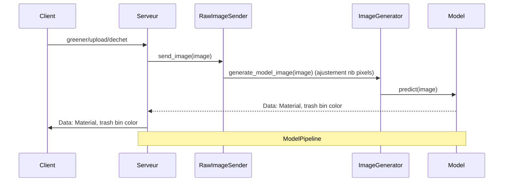

# Greener AI Pipeline

## Présentation

Ce projet étudie la possibilité de mettre en place un pipeline IA pour le projet *Greener* réalisé chez Epitech.

## Objectifs

- Mettre en place un pipeline IA capable d'analyser des images uploadées par un utilisateur d'une application.
- Analyser des images de déchets 
 afin de les classifier.

## Spécificités caractéristiques

Ce projet doit répondre aux spécificités techniques suivantes :

- Les modèles doivent être légers (taille raisonnable, à l'ordre maximum de centaines de mégaoctets).
- Le modèle ne doit pas consommer une grande puissance de calcul, afin d'économiser les coûts et pour des raisons écologiques (**PAS DE LLMs**).

## Spécificités techniques

Le projet doit répondre aux spécificités techniques suivantes :

- Respect des règles SOLID de programmation.
- Séparation du modèle dans un environnement isolé distinct (conteneurs Docker).

## Architecture

Le modèle de reconnaissance d'image sera implémenté dans un environnement qui lui sera dédié.
Voici le diagramme de séquence associé à la partie IA pour le traitement des déchets :

Avec :

- **RawImageSender** : Le composant qui va propager l'image brute dans l'enceinte du pipeline.
- **ImageGenerator** : Le composant qui va ajuster les paramètres de l'image afin qu'elle soit conforme aux attentes de l'entrée du modèle.
- **Model** : Le composant qui va prédire le contenu de l'image et le classifier selon les résultats de cette prédiction.

## Technologies

Pour les technologies, le langage principal qui sera utilisé dans cette partie est le langage **Python**,
pour sa popularité ainsi que sa richesse en modules de développement en IA. Pour le framework web,
on utilisera **FastAPI** pour sa simplicité et ses performances. On utilisera également un modèle
pré-entraîné de **Hugging Face** ([lien du modèle](https://github.com/yuechen-yang/garbage-classification/tree/main).
Enfin, pour la gestion du modèle, on utilisera le module **Keras**, qui est une plateforme de Machine
Learning très pratique, et économique en temps de développement et en nombre de lignes de code.
Pour la gestion des packages Python, on utilisera **uv**, qui est un gestionnaire de modules Python
ultra-rapide codé en Rust.
Enfin, pour le déploiement, le projet sera déployé sous forme de conteneurs **Docker**.
