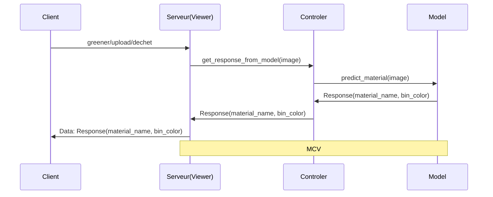

## Installation et lancement

### Prérequis

- Python 3.13+
- [uv](https://docs.astral.sh/uv/getting-started/installation/) installé
- Docker et Docker Compose (pour le lancement via conteneurs)

### Lancement en local avec uv

**1. Cloner le projet**

\`\`\`bash
git clone git@github.com:LuckyShuii/GreenHub-AI-.git
cd greener-ai-pipeline
\`\`\`

**2. Créer l'environnement virtuel et installer les dépendances**

\`\`\`bash
uv sync
\`\`\`

Cette commande crée automatiquement un environnement virtuel (`.venv`) et installe toutes les dépendances définies dans `pyproject.toml` en se basant sur `uv.lock`.

**3. Créer le fichier `.env`**

Créez un fichier `.env` à la racine du projet avec les variables nécessaires (voir `.env.example` si disponible).

**4. Lancer le projet**

\`\`\`bash
uv run python main.py
\`\`\`

---

### Lancement avec Docker

**1. Créer le fichier `.env`**

Assurez-vous d'avoir un fichier `.env` à la racine du projet avec les variables requises.

**2. Build et lancement avec Docker Compose**

\`\`\`bash
docker compose up --build
\`\`\`

**3. Lancement en arrière-plan (mode détaché)**

\`\`\`bash
docker compose up --build -d
\`\`\`

**4. Arrêter les conteneurs**

\`\`\`bash
docker compose down
\`\`\`

**5. Voir les logs**

\`\`\`bash
docker compose logs -f
\`\`\`

---

### Commandes utiles avec uv

| Commande | Description |
|----------|-------------|
| `uv sync` | Installe/synchronise les dépendances |
| `uv sync --no-dev` | Installe uniquement les dépendances de production |
| `uv add <package>` | Ajoute une nouvelle dépendance |
| `uv run python main.py` | Lance le projet dans l'environnement virtuel |
| `uv run pytest` | Lance les tests |
| `uv lock` | Met à jour le fichier `uv.lock` |

# Greener AI Pipeline

## Présentation

Ce projet étudie la possibilité de mettre en place un pipeline IA pour le projet *Greener* réalisé chez Epitech.

## Objectifs

- Mettre en place un pipeline IA capable d'analyser des images uploadées par un utilisateur d'une application.
- Analyser des images de déchets 
 afin de les classifier.

## Caractéristiques

Ce projet doit avoir  les caractéristiques techniques suivantes :

- Les modèles doivent être légers (taille raisonnable, à l'ordre maximum de centaines de mégaoctets).
- Le modèle ne doit pas consommer une grande puissance de calcul, afin d'économiser les coûts et pour des raisons écologiques (**PAS DE LLMs**).

## Spécificités techniques

Le projet doit répondre aux spécificités techniques suivantes :

- Respect des règles SOLID de programmation.
- Séparation du modèle dans un environnement isolé distinct (conteneurs Docker).

## Architecture
Le projet aura comme architecture MVC (Model, Controller, Viewer).
Le modèle de reconnaissance d'image sera implémenté dans un environnement qui lui sera dédié.
Voici le diagramme de séquence associé à la partie IA pour le traitement des déchets :

Avec :

- **Viewer** : Interface de haut niveau avec laquelle le client interagit.
- **Controller** : Il sert d'intermédiaire entre le Viewer et le Model.
- **Model** : Le composant qui va prédire le contenu de l'image et le classifier selon les résultats de cette prédiction.

## Technologies

Pour les technologies, le langage principal qui sera utilisé dans cette partie est le langage **Python**,
pour sa popularité ainsi que sa richesse en modules de développement en IA. Pour le framework web,
on utilisera **FastAPI** pour sa simplicité et ses performances. On utilisera également un modèle
pré-entraîné de **Hugging Face** [lien du modèle](https://github.com/yuechen-yang/garbage-classification/tree/main) avec une précision de 95%.
Pour la gestion des packages Python, on utilisera **uv**, qui est un gestionnaire de modules Python
ultra-rapide codé en Rust.
Enfin, pour le déploiement, le projet sera déployé sous forme de conteneurs **Docker**.

## Perspectives
Les perspectives pour ce projet sont :
- Implémenter les tests
- Implémenter un conteneur Docker
